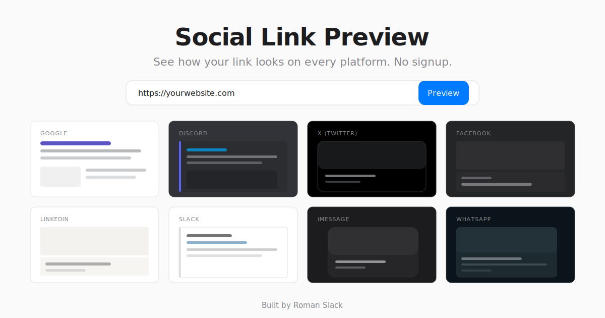

# Social Link Preview



**Paste a URL, instantly see how it looks on 8 platforms. No signup. No BS.**

Built by [Roman Slack](https://romanslack.com)

## Tech Stack

- **Backend:** Node.js + Express + Cheerio
- **Frontend:** Vanilla HTML / CSS / JS
- **Build tools:** None. Zero frameworks.

## Features

- Instant previews for **Google, Discord, X/Twitter, Facebook, LinkedIn, Slack, iMessage, WhatsApp**
- Open Graph & Twitter Card meta tag extraction
- Favicon and theme-color detection
- SSRF protection & rate limiting
- Auto-saves last preview to localStorage
- Mobile responsive

## Quick Start

```bash
npm install
node server.js
```

Open [http://localhost:3000](http://localhost:3000)

## Why?

Every existing OG tag preview tool is paywalled, forces signups, or is full of ads. This one doesn't. Paste a URL, get your previews, done.

## Contact

- **Website:** [romanslack.com](https://romanslack.com)
- **Email:** romanslack1@gmail.com
- **GitHub:** [RomanSlack/Social_Link_Preview](https://github.com/RomanSlack/Social_Link_Preview)

---

## About Social Link Preview

Social Link Preview is a free, open source social media link preview tool and Open Graph debugger created by Roman Slack. It lets developers, marketers, SEO specialists, and content creators instantly preview how any URL will appear when shared on Google Search, Facebook, X (formerly Twitter), Discord, LinkedIn, Slack, Apple iMessage, and WhatsApp — all from a single page with no signup required.

### Open Graph Preview & Debugger

Test og:title, og:description, og:image, og:url, og:site_name, and og:type tags across every major platform in one click. Social Link Preview is a free alternative to Facebook's Sharing Debugger, the deprecated Twitter Card Validator, and LinkedIn's Post Inspector — without requiring any login or account.

### Twitter Card Validator Replacement

The official Twitter Card Validator was deprecated by X. Social Link Preview fills that gap, showing both summary and summary_large_image card types with accurate rendering of twitter:card, twitter:title, twitter:description, and twitter:image meta tags.

### Discord Embed Preview

See exactly how links render as Discord rich embeds — with theme-color borders, site name, title, description, and image, inside an accurate Discord message UI mockup.

### Platform-Accurate Previews

Each card faithfully reproduces the actual platform's styling: Google's blue links and SERP snippets, Facebook's dark cards, X's rounded previews, Discord's dark embeds, LinkedIn's gray info bars, Slack's left-bordered unfurls, iMessage's dark bubbles, and WhatsApp's compact cards.

### Use Cases

- Debug missing or broken og:image thumbnails before publishing
- Validate meta tags after deploying a website
- Preview blog post and landing page social sharing cards
- Test e-commerce product page link appearances
- Optimize social media click-through rates
- Audit meta tags for WordPress, Shopify, Next.js, Gatsby, Hugo, Squarespace, Wix, Webflow, and custom sites

### Keywords

social link preview, open graph preview, og tag tester, meta tag checker, twitter card validator, facebook sharing debugger, discord embed preview, linkedin post inspector, slack link unfurl, imessage link preview, whatsapp link preview, social media preview tool, free seo tool, og image preview, link preview checker, share debugger, url preview tool, meta tag validator, open graph debugger, social share preview
